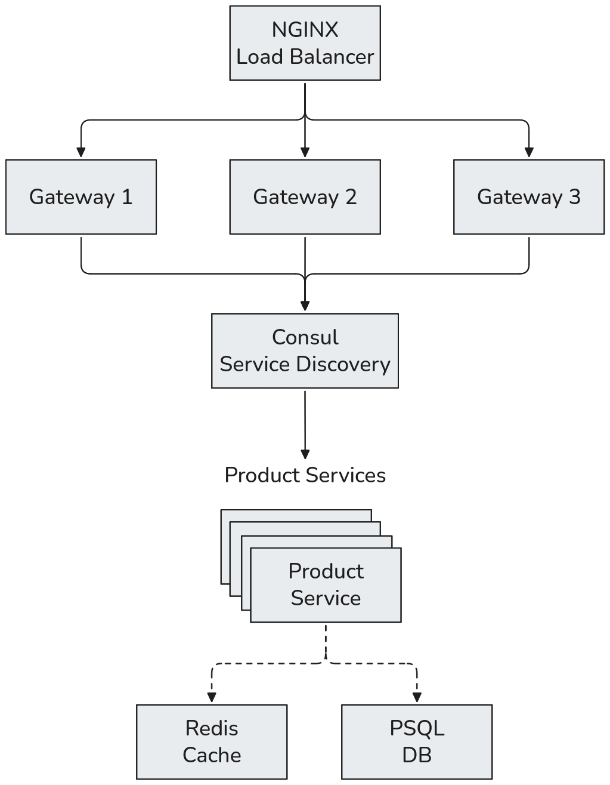

# mini-shop-observability

A Go-based microservices application with service discovery, horizontal scaling, caching, load balancing, and observability.

## Architecture



The gateway exposes the public HTTP API.

The product-service owns the product domain and communicates with PostgreSQL and Redis.

Consul provides service discovery so that gateways don't need to know the individual product-service container addresses.

## Running the Project

Build and start the stack with six product-service replicas:

```bash
docker compose up -d --build --scale product-service=6
```
Check the running services:

```
docker compose ps
```

The API is exposed through NGINX `http://localhost:8080`


## Why Scale

A single product-service instance can become a bottleneck when many requests arrive.

```
┌───────────────┐ 
│ Product       │ 
│ Service       │ 
└───────┬───────┘ 
        │ 
  all requests
```

With six instances:
```
                Product Service 
                      │ 
        ┌─────────────┼─────────────┐ 
        ▼             ▼             ▼ 
    replica 1     replica 2     replica 3 
        │             │             │ 
        └─────────────┼─────────────┘ 
                      │ 
        ┌─────────────┼─────────────┐ 
        ▼             ▼             ▼ 
    replica 4     replica 5     replica 6
```

## API

### Create Product

```bash
curl -X POST http://localhost:8080/products \
  -H "Content-Type: application/json" \
  -d '{"name":"Coffee"}'
>>> {"id":1,"name":"Coffee"}
```

### Get Product

```bash
curl http://localhost:8080/products/1
>>> {"id":1,"name":"Coffee"}
```


## OpenAPI
The gateway API is defined using OpenAPI.

Generate the Go API code with:
```
go tool oapi-codegen -config config.yaml openapi.yaml
```

## Protobuf / gRPC

The gateway communicates with product-service through gRPC.

Generate the protobuf and gRPC code with:

```bash
protoc \
  -I proto \
  --go_out=proto \
  --go_opt=module=mini-shop/proto \
  --go-grpc_out=proto \
  --go-grpc_opt=module=mini-shop/proto \
  proto/product/product.proto
  ```

The generated code is located under:

```
proto/productpb/
├── product.pb.go
└── product_grpc.pb.go
```

## Load Testing

The API can be benchmarked using hey.

Example:
```bash
hey -n 1000000 -c 100 http://localhost:8080/products/1
```

### Baseline

With Redis caching and six product-service replicas:

```
Requests:        1,000,000
Concurrency:     100
Requests/sec:    7,084.6
Average latency: 14.1 ms
P50:             8.0 ms
P95:             48.5 ms
P99:             88.4 ms
Successful:      1,000,000
Errors:          0
```

At higher concurrency, throughput continues to increase but latency and errors also increase. For example, at concurrency 1000, the system reached approximately 9,900 requests/sec while showing increased tail latency and request failures.

This provides a basis for examining how the different layers behave as concurrency increases.
